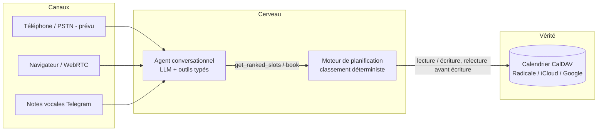

# Polyglot Booking Agent

[](https://github.com/abiotov/polyglot-booking-agent/actions/workflows/ci.yml)
[](https://www.python.org/)
[](LICENSE)
[](https://github.com/astral-sh/ruff)

> 🇬🇧 [English version](README.md)

Un agent vocal IA multilingue qui prend, déplace et annule des rendez-vous pour un cabinet (médical, dentaire, salon, garage), joignable depuis le **navigateur (voix temps réel WebRTC), Telegram (texte et notes vocales mélangés) et le terminal**, parlant **français et anglais avec bascule de langue en pleine conversation**. Un canal téléphonique classique (Twilio SIP) est la prochaine perspective.

L'idée centrale : **le LLM converse, il ne décide jamais.** Le choix des créneaux revient à un moteur de planification déterministe, testable et explicable. Le calendrier du cabinet (n'importe quel serveur CalDAV : iCloud, Google, Radicale) reste l'unique source de vérité.

> Statut : cœur complet. Le moteur, l'adaptateur calendrier, trois canaux de conversation, l'observabilité et le harnais d'évaluation sont construits, testés et durcis par des sessions réelles ; voir la [feuille de route](#feuille-de-route) et les [chiffres d'évaluation](#évaluation).

## Pourquoi ce projet

Les agents vocaux de prise de rendez-vous échouent généralement de deux façons : le LLM hallucine des disponibilités, ou le système propose « le premier créneau libre » et déchiquette la journée du praticien en trous de 15 minutes inutilisables. Ce projet traite les deux :

1. **Aucune réservation hallucinée.** Le LLM ne voit et ne réserve les créneaux qu'à travers des outils typés et strictement validés. Il ne lit jamais le calendrier brut.
2. **Compaction du planning.** Le moteur classe les créneaux libres comme le ferait une réceptionniste expérimentée : d'abord les créneaux adjacents aux rendez-vous existants, pour que la journée reste compacte et que les trous restent utilisables.
3. **Aucune migration de calendrier.** L'agent se branche sur le calendrier que le cabinet utilise déjà, via le standard CalDAV. Les modifications manuelles du praticien ont toujours le dernier mot.

## Architecture



Trois règles structurelles :

- **Les canaux sont des adaptateurs.** Téléphone, WebRTC et Telegram sont trois façons de transformer de l'audio en texte et inversement. Le cerveau ne sait pas d'où vient une conversation.
- **Le LLM converse, le moteur décide.** La compréhension du langage est probabiliste ; l'arithmétique des disponibilités ne l'est pas. La frontière entre les deux est un ensemble d'appels d'outils strictement validés.
- **Le calendrier est le seul état.** Pas de base de données parallèle. Le praticien peut bloquer un créneau depuis son téléphone en plein appel et l'agent le respecte (relecture avant chaque écriture).

## L'intelligence de planification

La journée est découpée en créneaux fixes (15 minutes par défaut). Le classement se fait en deux étapes :

**Étape 1 : contraintes dures.** Un créneau n'est candidat que s'il est libre, dans les heures d'ouverture, non bloqué manuellement, et dans une fenêtre autorisée pour ce type de client et de visite. Tout cela relève de la configuration, pas du code.

**Étape 2 : score de compaction.** Parmi les candidats, chaque créneau reçoit un score qui récompense la compacité du planning. Exemple avec des heures d'ouverture de 08:00 à 14:00 :

```text
08:00 libre   08:15 libre   08:30 OCCUPÉ   08:45 libre
09:00 libre   09:15 libre   09:30 libre    09:45 OCCUPÉ   10:00 libre
```

Le moteur classe 08:15 et 09:30 en premier (chacun se trouve juste avant un rendez-vous existant), puis 08:45 et 10:00 (juste après un rendez-vous), et seulement ensuite 09:00 ou 09:15, car les réserver créerait un îlot isolé et deux trous inutilisables.

Chaque score est retourné décomposé (par exemple `{"adjacent_before": 10, "premium_window": 5}`), donc « pourquoi avoir proposé 9h30 ? » a toujours une vraie réponse. `rank_slots()` est une fonction pure : mêmes entrées, même sortie, ce qui la rend testable unitairement et par propriétés (Hypothesis) d'une manière que peu de projets IA peuvent revendiquer.

## Bascule de langue

Chaque prise de parole de l'appelant reçoit une langue détectée (mode multilingue de Deepgram sur les notes vocales, score de mots marqueurs sur la transcription en temps réel), et le canal préfixe le tour d'un tag `[lang=xx]` faisant autorité : un marquage déterministe, car les tests en conditions réelles ont montré que les modèles ignorent une bascule en pleine conversation quand elle ne repose que sur le prompt. La réponse est vocalisée avec la voix TTS correspondante, même persona vocale dans les deux langues. Un appelant peut commencer en français et finir en anglais sans le moindre accroc ; ajouter une langue relève de la configuration plus une traduction de prompt.

## Pile technique

| Besoin | Défaut | Interchangeable avec |
| --- | --- | --- |
| LLM | OpenAI gpt-4o-mini | Gemini Flash, Claude (interface commune `LLMProvider`) |
| STT | Deepgram nova-3 (streaming, multilingue) | faster-whisper (local) |
| TTS | Cartesia Sonic (moins de 100 ms) | Piper (local, coût nul) |
| Transport temps réel | LiveKit Agents (WebRTC, interruptions) | |
| Téléphonie (prévue) | Trunk SIP Twilio | N'importe quel fournisseur SIP |
| Messagerie | API Telegram Bot | |
| Calendrier | Radicale (développement) | iCloud, Google, tout serveur CalDAV |

Chaque fournisseur se trouve derrière une petite interface. En changer revient à modifier une variable d'environnement, pas à réécrire l'agent.

## Structure du projet

```text
├── src/
│   ├── scheduling_engine/   # logique métier pure : contraintes, score de compaction
│   ├── calendar_adapter/    # E/S CalDAV, relecture avant écriture, serveur de dev intégré
│   ├── agent/               # boucle LLM, outils stricts, fournisseurs interchangeables, CLI
│   ├── speech/              # STT Deepgram, TTS Cartesia, détection de langue
│   ├── channels/            # bot Telegram, temps réel LiveKit (console + navigateur)
│   └── observability/       # traçage Opik optionnel, strictement inactif sans configuration
├── evals/                   # harnais agent-contre-agent : scénarios, checks, juge
├── scripts/                 # serveur radicale, peuplement, démos, appels navigateur
├── config/                  # practice.example.yaml (toutes les règles métier)
├── docs/                    # architecture et décisions de conception
└── tests/                   # unitaires, par propriétés et intégration CalDAV réelle
```

## Démarrage rapide

```bash
git clone https://github.com/abiotov/polyglot-booking-agent.git
cd polyglot-booking-agent
uv sync --extra dev
uv run pytest
```

Essayer le moteur contre un vrai calendrier :

```bash
# terminal 1 : serveur CalDAV local (Radicale, intégré au processus, compatible Windows)
uv run python scripts/run_radicale.py

# terminal 2 : peupler une semaine réaliste, puis classer les créneaux du lundi
uv run python scripts/seed_calendar.py
uv run python - <<'PY'
from datetime import date, timedelta
from calendar_adapter import CalDAVCalendar
from scheduling_engine import load_config, rank_slots

cal = CalDAVCalendar(url="http://127.0.0.1:5232", username="agent", password="agent",
                     timezone="Africa/Porto-Novo")
monday = date.today() - timedelta(days=date.today().weekday())
for slot in rank_slots(monday, cal.busy_intervals(monday), "premium",
                       load_config("config/practice.example.yaml"))[:5]:
    print(slot.start.strftime("%H:%M"), slot.score, slot.score_breakdown)
PY
```

Pointez Thunderbird ou DAVx5 sur `http://127.0.0.1:5232` pour modifier le
même calendrier à la main et voir le classement réagir.

Parler à l'agent (nécessite `OPENAI_API_KEY` ou `GEMINI_API_KEY` dans `.env`,
voir `.env.example`) :

```bash
uv run python -m agent.cli --provider openai      # chat interactif
uv run python scripts/demo_conversation.py        # rejoue une réservation complète,
                                                  # du français à l'anglais en plein échange
uv run python -m channels.livekit_agent console   # voix temps réel, micro local
```

Appeler l'agent depuis le navigateur, entièrement auto-hébergé (télécharger
`livekit-server` depuis les [releases livekit/livekit](https://github.com/livekit/livekit/releases)
dans `tools/`) :

```bash
./tools/livekit-server --dev                      # terminal 1 : serveur WebRTC
uv run python -m channels.livekit_agent dev       # terminal 2 : l'agent
uv run python scripts/browser_call.py             # affiche un lien navigateur
```

## Feuille de route

- [x] Amorçage du dépôt, CI, documentation
- [x] **Le cerveau.** Moteur de planification (contraintes + score de compaction, tests unitaires et par propriétés), adaptateur CalDAV (relecture avant écriture, événements propriété de l'agent, tests d'intégration sur Radicale réel), agent en mode texte (outils stricts, adaptateurs OpenAI/Gemini, FR/EN avec bascule en pleine conversation)
- [x] **Telegram.** Texte et voix mélangés dans une même conversation, notes vocales en entrée et en sortie (Deepgram nova-3 multilingue + Cartesia sonic-3, une seule voix dans les deux langues), sessions isolées par chat, recherche/annulation/report par numéro de téléphone, durci par des sessions réelles (voir [docs/design-decisions.fr.md](docs/design-decisions.fr.md))
- [x] **Temps réel.** Pipeline LiveKit (même cerveau via `llm_node`), mode console local et appels navigateur auto-hébergés, interruption de l'agent (barge-in), bascule de langue en direct, phrase d'attente parlée pendant les appels d'outils ; réservation vocale complète validée en session réelle (2,1 à 4,8 s par tour)
- [x] **La preuve.** Harnais d'évaluation agent-contre-agent : 12 scénarios (créneaux volés en plein appel, identités déformées, escalades), verdicts déterministes + juge LLM consultatif, rapports de campagne, traces Opik avec scores, workflow CI hebdomadaire et à la demande. Campagnes : 11-12/12
- [x] **Observabilité.** Traçage Opik optionnel sur tous les canaux, inactif sans configuration

### Perspectives

- [ ] **Téléphonie PSTN** : un numéro de téléphone (trunk SIP Twilio) relié au même cerveau, appelable depuis n'importe quel téléphone
- [ ] Visualiseur du score de créneaux (la grille de classement, scores expliqués au survol)
- [ ] Campagnes de comparaison de fournisseurs (`--provider gemini`) publiées côte à côte
- [ ] Streaming token par token du cerveau vers le TTS (gain de latence d'environ 1 à 2 s en temps réel)

## Évaluation

L'agent est testé par des agents : des patients simulés par LLM
(tournant sur un fournisseur différent de l'agent testé) jouent
12 scénarios scriptés contre le cerveau de production et un calendrier
réel, dont une course au créneau injectée en plein appel par le runner,
un nom déformé par le STT qui doit être récupéré en le faisant épeler,
et une journée entièrement bloquée qui doit se terminer par une
escalade. Les verdicts sont déterministes (état final du calendrier +
trace d'outils, voir `evals/checks.py`) ; un juge LLM ajoute des
observations qualitatives consultatives mais ne bloque jamais.

Campagnes du 15/07/2026, agent `gpt-4o-mini`, personas/juge
`gemini-2.5-flash` (le comportement d'un LLM est stochastique ; les
runs fluctuent entre 11/12 et 12/12, et l'échec récurrent est toujours
le même) :

| métrique | résultat |
| --- | --- |
| scénarios réussis | **11-12 / 12** |
| zéro horaire halluciné | 12/12 |
| réservations limitées aux créneaux proposés | 12/12 |
| qualification avant toute disponibilité | 12/12 |
| langue respectée (y compris bascule en plein appel) | 12/12 |
| contrat de résultat (réservation/annulation/report, identité exacte, fenêtre) | 11-12/12 |
| juge : identité relue avant réservation | 9/10 |
| juge : ton professionnel | 11/12 |

Le seul scénario instable est `garbled-identity` (un nom déformé par le
STT qui doit être récupéré en demandant à l'appelant de l'épeler) :
l'agent réserve parfois le nom déformé. C'est le point faible connu des
canaux vocaux, observé d'abord en session réelle, désormais quantifié à
chaque campagne au lieu d'être discuté sans preuve.

Reproduire avec `uv run python -m evals` (nécessite OPENAI_API_KEY et
GEMINI_API_KEY). Les premières campagnes ont attrapé de vrais défauts,
depuis corrigés et couverts par des tests de régression : numéros de
téléphone au format local manqués par la recherche de réservations,
réservations silencieusement supposées pour aujourd'hui quand aucun
jour n'était donné, arithmétique de dates du LLM résolvant « mercredi
prochain » sur un week-end (corrigée par une référence de dates
déterministe dans le prompt et l'écho du jour dans les résultats
d'outils), et plusieurs checks trop stricts (voir la décision de
conception 8).

## Observabilité (optionnelle)

Chaque conversation peut être tracée vers [Opik](https://github.com/comet-ml/opik)
(open source, Apache 2.0) : une trace par tour, avec des spans imbriqués
pour chaque appel LLM, appel d'outil, transcription et synthèse, leurs
entrées, sorties et latences. Les campagnes d'évaluation (phase 5)
s'enregistrent comme expériences pour comparer côte à côte prompts et
fournisseurs.

Renseignez `OPIK_API_KEY` + `OPIK_WORKSPACE` dans `.env` (palier gratuit
du cloud Comet) ou `OPIK_URL_OVERRIDE` (auto-hébergé). Sans ces
variables, l'observabilité est strictement inactive : aucun import,
aucun réseau, tests et CI restent hermétiques. Opik sert à voir et à
comparer, jamais à juger ; les verdicts restent du ressort des checks
déterministes (voir la décision de conception 8).

## Décisions de conception

Les développements complets se trouvent dans [docs/design-decisions.fr.md](docs/design-decisions.fr.md). En résumé :

- **Pourquoi le LLM ne choisit jamais un créneau :** fiabilité et auditabilité. Une réservation doit être reproductible à partir de la trace d'appels d'outils.
- **Pourquoi CalDAV plutôt qu'une base de données :** zéro migration pour le cabinet, développement local gratuit (Radicale), et les modifications manuelles gardent autorité.
- **Pourquoi la relecture avant écriture :** le praticien peut prendre un créneau depuis son téléphone pendant qu'un appelant est en ligne. L'agent revérifie et propose autre chose avec élégance.
- **Pourquoi des adaptateurs de fournisseurs partout :** aucune dépendance à un fournisseur, et le projet reste démontrable à coût d'infrastructure nul.
- **Pourquoi les dates sont résolues par le harnais, pas par le modèle :** une session réelle a montré « mercredi prochain » résolu sur un week-end et relayé comme « aucune disponibilité » ; le prompt porte désormais une référence de dates déterministe et chaque réponse d'outil rappelle le jour concerné.
- **Pourquoi les sessions réelles et les campagnes d'évaluation sont la suite de tests :** chaque échec observé en conditions réelles est devenu une protection dans le code ; voir les décisions 8 et 9.

## Licence

[MIT](LICENSE)
