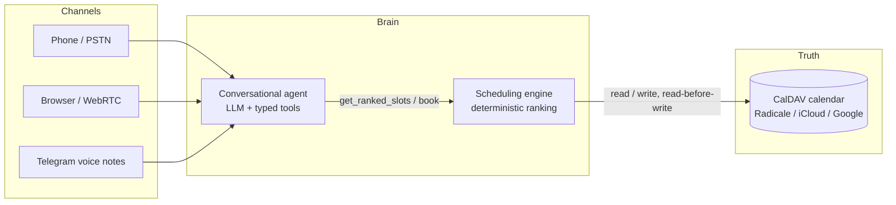

# Polyglot Booking Agent

[](https://github.com/abiotov/polyglot-booking-agent/actions/workflows/ci.yml)
[](https://www.python.org/)
[](LICENSE)
[](https://github.com/astral-sh/ruff)

A multilingual voice AI agent that books, reschedules and cancels appointments for a practice (medical office, dental clinic, salon, garage), reachable over **phone, browser (WebRTC) and Telegram**, speaking **French and English with mid-conversation language switching**.

The core idea: **the LLM converses, it never decides.** Slot selection is a deterministic, testable, explainable scheduling engine. The practice calendar (any CalDAV server: iCloud, Google, Radicale) remains the single source of truth.

> Status: under active development. Phase 1 (scheduling engine + calendar adapter + text agent) in progress. See the [roadmap](#roadmap).

## Why this project

Voice booking agents usually fail in one of two ways: the LLM hallucinates availability, or the system offers "the first free slot" and shreds the practitioner's day into unusable 15-minute holes. This project addresses both:

1. **No hallucinated bookings.** The LLM can only see and book slots through typed, strictly validated tools. It never reads the raw calendar.
2. **Schedule compaction.** The engine ranks free slots the way an experienced receptionist would: slots adjacent to existing appointments first, so the day stays compact and gaps stay usable.
3. **No calendar migration.** The agent plugs into the calendar the practice already uses, through the CalDAV standard. Manual edits made by the practitioner always win.

## Architecture



Three structural rules:

- **Channels are adapters.** Phone, WebRTC and Telegram are three ways to turn audio into text and back. The brain does not know where a conversation comes from.
- **The LLM converses, the engine decides.** Language understanding is probabilistic; availability arithmetic is not. The boundary between the two is a set of strictly validated tool calls.
- **The calendar is the only state.** No shadow database. The practitioner can block a slot from their phone mid-call and the agent respects it (read-before-write on every booking).

## The scheduling intelligence

The day is divided into fixed slots (default 15 minutes). Ranking happens in two stages:

**Stage 1: hard constraints.** A slot is a candidate only if it is free, inside opening hours, not manually blocked, and inside a window allowed for this client type and visit type. All of it is configuration, not code.

**Stage 2: compaction scoring.** Among candidates, each slot gets a score that rewards keeping the schedule compact. Example with opening hours 08:00 to 14:00:

```text
08:00 free   08:15 free   08:30 BOOKED   08:45 free
09:00 free   09:15 free   09:30 free     09:45 BOOKED   10:00 free
```

The engine ranks 08:15 and 09:30 first (each sits right before an existing appointment), then 08:45 and 10:00 (right after one), and only then 09:00 or 09:15, because booking those would create an isolated island and two unusable gaps.

Every score is returned decomposed (for example `{"adjacent_before": 10, "premium_window": 5}`), so "why did you offer 9:30?" always has a real answer. `rank_slots()` is a pure function: same inputs, same output, which makes it unit-testable and property-testable (Hypothesis) in a way most AI projects are not.

## Language switching

Speech-to-text (Deepgram nova-3) tags every utterance with its detected language. The agent replies in the language of the last user message, and the orchestrator picks the matching TTS voice (French or English). A caller can start in French and finish in English without missing a beat. Adding a language is configuration: one STT language code, one voice, one prompt translation.

## Tech stack

| Concern | Default | Swappable with |
| --- | --- | --- |
| LLM | OpenAI gpt-4o-mini | Gemini Flash, Claude (common `LLMProvider` interface) |
| STT | Deepgram nova-3 (streaming, multilingual) | faster-whisper (local) |
| TTS | Cartesia Sonic (sub-100ms) | Piper (local, zero cost) |
| Realtime transport | LiveKit Agents (WebRTC, interruptions) | |
| Telephony | Vapi (free US number) | Any SIP trunk |
| Messaging | Telegram Bot API | |
| Calendar | Radicale (dev) | iCloud, Google, any CalDAV server |

Every provider sits behind a small interface. Swapping means changing an environment variable, not rewriting the agent.

## Project structure

```text
├── src/
│   ├── scheduling_engine/   # pure domain logic: constraints, scoring, config
│   ├── calendar_adapter/    # CalDAV I/O, read-before-write, dev server
│   └── agent/               # LLM loop, strict tools, providers, prompts, CLI
├── channels/                # telegram, livekit, vapi           (phases 2-4)
├── evals/                   # simulated patients + LLM judge    (phase 5)
├── scripts/                 # run_radicale.py, seed_calendar.py
├── config/                  # practice.example.yaml
├── docs/                    # architecture and design decisions
└── tests/                   # unit, property-based and live-CalDAV integration
```

## Quickstart

```bash
git clone https://github.com/abiotov/polyglot-booking-agent.git
cd polyglot-booking-agent
uv sync --extra dev
uv run pytest
```

Try the engine against a real calendar:

```bash
# terminal 1: local CalDAV server (Radicale, in-process, Windows-safe)
uv run python scripts/run_radicale.py

# terminal 2: seed a realistic week, then rank Monday's slots
uv run python scripts/seed_calendar.py
uv run python - <<'PY'
from datetime import date, timedelta
from calendar_adapter import CalDAVCalendar
from scheduling_engine import load_config, rank_slots

cal = CalDAVCalendar(url="http://127.0.0.1:5232", username="agent", password="agent",
                     timezone="Africa/Porto-Novo")
monday = date.today() - timedelta(days=date.today().weekday())
for slot in rank_slots(monday, cal.busy_intervals(monday), "premium",
                       load_config("config/practice.example.yaml"))[:5]:
    print(slot.start.strftime("%H:%M"), slot.score, slot.score_breakdown)
PY
```

Point Thunderbird or DAVx5 at `http://127.0.0.1:5232` to edit the same
calendar by hand and watch the ranking react.

Talk to the agent (needs `OPENAI_API_KEY` or `GEMINI_API_KEY` in `.env`,
see `.env.example`):

```bash
uv run python -m agent.cli --provider openai      # interactive chat
uv run python scripts/demo_conversation.py        # replay a full booking,
                                                  # French to English mid-call
```

## Roadmap

- [x] Repository bootstrap, CI, docs
- [x] **Phase 1: the brain.**
  - [x] Scheduling engine: constraints + compaction scoring, unit and property-based tests
  - [x] CalDAV adapter: read-before-write, agent-owned events, live-Radicale integration tests
  - [x] Text-mode agent: strict tools, OpenAI/Gemini adapters, FR/EN with mid-call switching
- [x] **Phase 2: Telegram.** Mixed text and voice in one conversation, voice notes in and out (Deepgram nova-3 multilingual + Cartesia sonic-3, one voice across languages), per-chat sessions, find/cancel/reschedule by phone number, all hardened against real sessions (see [docs/design-decisions.md](docs/design-decisions.md))
- [x] **Phase 3: realtime.** LiveKit pipeline (same brain via `llm_node`), local console voice mode, barge-in, live language switching, spoken filler during tool rounds; full voice booking with digit-by-digit phone correction validated live (2.1-4.8s per turn)
- [ ] **Phase 4: phone.** Free Vapi number wired to the same brain, end-to-end call demo
- [ ] **Phase 5: proof.** Agent-vs-agent eval harness (simulated patients + structured judge), per-language success metrics in CI, slot-scoring visualizer

## Observability (optional)

Every conversation can be traced to [Opik](https://github.com/comet-ml/opik)
(open source, Apache 2.0): one trace per turn, with nested spans for
each LLM round, tool call, transcription and synthesis, their inputs,
outputs and latencies. Eval campaigns (phase 5) log as experiments for
side-by-side comparison across prompts and providers.

Set `OPIK_API_KEY` + `OPIK_WORKSPACE` in `.env` (Comet cloud free tier)
or `OPIK_URL_OVERRIDE` (self-hosted). Without them, observability is a
strict no-op: no import, no network, tests and CI stay hermetic. Opik
is used for seeing and comparing only; pass/fail verdicts stay with the
deterministic checks (see design decision 8).

## Design decisions

Longer write-ups live in [docs/design-decisions.md](docs/design-decisions.md). The short version:

- **Why the LLM never picks a slot:** reliability and auditability. A booking must be reproducible from the tool-call trace.
- **Why CalDAV instead of a database:** zero migration for the practice, free local development (Radicale), and manual edits stay authoritative.
- **Why read-before-write:** the practitioner can take a slot from their phone while a caller is on the line. The agent re-checks and gracefully re-offers.
- **Why provider adapters everywhere:** no vendor lock-in, and the project stays demoable at zero infrastructure cost.

## License

[MIT](LICENSE)
