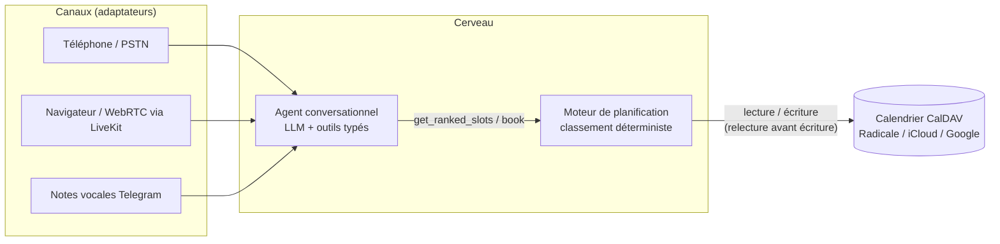

# Architecture

🇬🇧 [English version](architecture.md)

> Document vivant. Mis à jour à la fin de chaque phase ; les sections
> des composants non encore construits sont marquées comme prévues.

## Vue d'ensemble



Le système est composé de trois couches aux frontières strictes :

| Couche | Responsabilité | Ne doit jamais |
| --- | --- | --- |
| Canaux | Transformer l'audio/le texte d'un transport donné en messages pour l'agent et inversement | Contenir de la logique métier |
| Agent | Comprendre l'appelant, collecter la qualification, appeler les outils | Décider des disponibilités ou inventer des créneaux |
| Moteur + calendrier | Décider quels créneaux existent, dans quel ordre, et persister les réservations | Parler à l'utilisateur |

## Composants

### Moteur de planification (`src/scheduling_engine/`) - construit

Une bibliothèque pure, sans E/S, sans dépendance au LLM. API publique :

```python
rank_slots(day, busy_intervals, client_type, config) -> list[ScoredSlot]
```

Deux étapes :

1. **Contraintes dures.** La journée est découpée en créneaux fixes
   (15 minutes par défaut) à l'intérieur des heures d'ouverture. Un
   créneau ne survit que s'il est libre, n'intersecte aucun blocage
   manuel, et entre dans une fenêtre autorisée pour le type de client.
   Tous les seuils viennent de `PracticeConfig` (YAML).
2. **Score de compaction.** Chaque créneau survivant gagne des points
   par voisin occupé (`adjacent_before`, 10 par défaut ;
   `adjacent_after`, 8 par défaut). Un créneau qui comble un trou d'un
   seul créneau entre deux rendez-vous gagne les deux. Les créneaux
   isolés obtiennent 0 et sont proposés en dernier. L'adjacence
   s'évalue à l'intérieur d'une même fenêtre d'ouverture : une pause
   déjeuner sépare les voisinages.

Chaque `ScoredSlot` porte un `score_breakdown` dont les valeurs
s'additionnent pour donner le score, si bien que toute décision de
classement peut être tracée et affichée.

Le déterminisme est un contrat, vérifié par les tests : mêmes entrées,
même sortie, tri par score décroissant puis heure de début croissante.

### Adaptateur calendrier (`src/calendar_adapter/`) - construit

Traduit entre la vue `BusyInterval` du moteur et un serveur CalDAV.
Comportements clés, tous couverts par des tests d'intégration contre
une instance Radicale réelle (le même serveur de développement intégré
au processus que celui du démarrage rapide) :

- **Relecture avant écriture.** `book()` revérifie la plage sur le
  calendrier vivant juste avant d'écrire. Si elle a été prise entre
  temps (le praticien l'a bloquée depuis son téléphone),
  `SlotTakenError` est levée et l'agent reclasse puis propose autre
  chose. CalDAV n'a pas de transactions ; ce mécanisme réduit la
  fenêtre de course à quelques millisecondes, ce qui est acceptable
  pour le calendrier d'un cabinet unique.
- **Jamais d'écrasement.** Chaque événement créé par l'agent porte la
  catégorie `POLYGLOT-AGENT` ; `cancel()` et `reschedule()` refusent
  tout le reste (`NotAgentEventError`). Les événements propres du
  praticien sont des faits en lecture seule.
- **Blocages manuels et congés respectés.** Les événements marqués
  `BLOCK` apparaissent comme `kind="block"` ; les événements sur la
  journée entière bloquent toute la journée.
- Radicale en développement, n'importe quel point d'accès CalDAV en
  production. La conversion de fuseau horaire se fait ici ; le moteur
  travaille en heure locale naïve du cabinet.

`calendar_adapter.devserver` sert Radicale dans le processus pour le
développement et les tests (il contourne aussi une vérification au
démarrage de Radicale qui plante sur Windows sans le mode développeur).
`scripts/run_radicale.py` le démarre ; `scripts/seed_calendar.py`
remplit une semaine de démonstration réaliste.

### Agent conversationnel (`src/agent/`) - construit (mode texte)

Une boucle d'appels d'outils LLM. Les outils sont l'unique pont vers le
moteur :

| Outil | Contrat |
| --- | --- |
| `qualify` | Type de client, type de visite et service validés par énumérations. Obligatoire avant toute réponse sur les disponibilités. |
| `get_ranked_slots` | Retourne les créneaux classés par le moteur. Le LLM ne voit jamais le calendrier brut. |
| `book` | Exige un `slot_id` retourné auparavant par `get_ranked_slots`, plus un nom et un téléphone confirmés. |
| `reschedule` / `cancel` | N'opèrent que sur les événements créés par l'agent. |

Tous les schémas d'outils sont stricts (aucune propriété
supplémentaire, énumérations pour les ensembles fermés), donc un appel
malformé échoue à la validation au lieu de corrompre l'état. Deux
invariants sont imposés dans le code, pas dans le prompt : aucune
disponibilité sans qualification, et book/reschedule n'acceptent qu'un
slot_id issu de la dernière offre classée, si bien que le modèle ne
peut pas réserver un horaire qu'il aurait inventé.

Les fournisseurs LLM sont des adaptateurs sans état derrière une
interface unique (`agent/providers/`) : OpenAI (gpt-4o-mini) et Gemini
(2.5-flash) sont implémentés et testés en conditions réelles ;
l'historique de conversation est conservé dans un format neutre et
traduit à chaque appel, ce qui rend les fournisseurs interchangeables
en cours de projet. Un fournisseur scripté pilote la suite de tests,
donc la boucle et la boîte à outils sont entièrement testées sans
aucune clé d'API.

La boucle est bornée (nombre maximal de tours d'outils, réponse de
secours) et exposée via une CLI interactive (`python -m agent.cli`) et
une démonstration rejouable (`scripts/demo_conversation.py`).

### Bascule de langue - construite (texte et voix Telegram)

Le canal marque chaque prise de parole avec sa langue détectée
(Deepgram la fournit par énoncé sur les canaux vocaux) ; la boucle
préfixe un tag `[lang=xx]` faisant autorité, que le prompt système
déclare contraignant. Le marquage déterministe bat l'espoir que le
modèle s'en aperçoive : les tests en conditions réelles ont montré que
les deux fournisseurs ignoraient une bascule en plein appel tant que le
tag n'existait pas. L'orchestrateur sélectionne la voix TTS à partir du
même tag. Ajouter une langue relève de la configuration plus une
traduction de prompt, pas du code.

### Canaux

**Telegram (`src/channels/`) - construit (phase 2).** Texte et voix se
mélangent librement dans une même conversation ; la modalité est
symétrique (texte entrant, texte sortant ; voix entrante, note vocale
sortante avec la transcription en légende). Une session d'agent isolée
par chat. La logique du canal est indépendante du SDK et entièrement
testée avec de faux fournisseurs de parole ; la glue
python-telegram-bot ajoute les indicateurs d'activité (en train
d'écrire / d'enregistrer), des délais réseau élargis pour les
connexions lentes, et un gestionnaire d'erreurs qui demande toujours à
l'appelant de renvoyer son message au lieu d'échouer en silence.

La couche de parole (`src/speech/`) a été durcie par de vraies sessions
téléphoniques, pas seulement par des tests synthétiques :

- Deepgram nova-3 en mode multilingue transcrit bien le FR et l'EN et
  marque la langue de chaque mot ; la langue de l'énoncé est la langue
  dominante des mots parmi les langues déclarées du cabinet.
- Deux couches de récupération attrapent les échecs de reconnaissance
  observés en réel : les transcriptions vides et les hallucinations en
  écritures non latines (un clip français bruité est revenu un jour en
  mandarin) sont retentées avec la langue de secours imposée.
- Des clients HTTP persistants partout : l'établissement TLS à chaque
  clip coûtait des secondes sur une connexion lente (mesuré de 3,0 s à
  0,4 s).

**Temps réel (`src/channels/livekit_agent.py`) - construit (phase 3).**
LiveKit Agents fournit le corps temps réel (micro, VAD, STT en
streaming, interruption de l'agent, lecture TTS) ; le cerveau
conversationnel reste le BookingAgent du projet, branché en surchargant
`Agent.llm_node`. LiveKit ne voit jamais les outils ni le calendrier.
Le mode console tourne entièrement en local
(`python -m channels.livekit_agent console`).

Spécificités du temps réel, chacune apprise d'une session réelle :

- **LLM factice au niveau session** : livekit-agents saute
  silencieusement la génération de réponse quand la session n'a pas de
  llm défini, même avec llm_node surchargé ; une instance de plugin
  jamais invoquée satisfait cette vérification.
- **Phrase d'attente parlée** : le cerveau émet des événements de
  progression (`run_turn_events`), et le canal dit « un instant, je
  consulte le planning » dès qu'un tour d'outils calendrier démarre.
  Le silence mesuré est passé de 5-13 s à environ 1,5 s ; la latence
  de bout en bout par tour de 5,5-14,7 s à 2,1-4,8 s après cela, plus
  le réglage de la détection de fin de parole (0,6 s minimum) et un
  micro filaire (un casque Bluetooth ajoutait à lui seul environ 12 s
  de délai STT).
- **Langue du tour depuis le texte** : speech.langdetect sur la
  transcription (mots marqueurs + diacritiques, les tours ambigus
  gardent la langue précédente), pilotant à la fois le tag [lang=xx]
  et la voix Cartesia via update_options. Les transcriptions
  hallucinées en écritures non latines sont refusées avec un
  « pourriez-vous répéter » au lieu d'atteindre le cerveau.
- Les diagnostics de session sont recopiés dans
  logs/realtime-session.log.

**Prévu :**

- **Téléphonie PSTN** : un numéro de téléphone (trunk SIP Twilio) relié
  au même cerveau ; l'opérateur est un adaptateur de transport comme
  chaque canal.

### Observabilité (`src/observability/`) - construite

Un adaptateur mince au-dessus d'Opik, activé seulement s'il est
configuré (OPIK_API_KEY ou OPIK_URL_OVERRIDE), strictement inactif
sinon. `traced()` décore les fonctions porteuses : `run_turn` (racine
de trace), les appels `complete` des fournisseurs (spans llm), le
`dispatch` de la boîte à outils (spans d'outils), les adaptateurs
STT/TTS et les handlers du canal Telegram. La vérification a lieu à
l'appel, pas à l'import, pour que les points d'entrée puissent charger
.env dans main(). Les verdicts ne viennent jamais d'Opik : il visualise
et compare, les checks déterministes jugent.

### Harnais d'évaluation (`evals/`) - construit (phase 5)

Des personas de patients simulés par LLM (sur un fournisseur différent
de l'agent testé) jouent des scénarios YAML contre le cerveau de
production et un calendrier réel remis à neuf par scénario. Le runner
peut injecter une course en plein appel (un événement manuel atterrit
sur le meilleur créneau proposé, comme le ferait le téléphone du
praticien).

Le verdict est en couches, conformément à la décision de conception 8 :

- **Les checks déterministes bloquent** : état final du calendrier
  confronté au contrat du scénario (résultat, identité exacte avec
  normalisation du téléphone, fenêtre autorisée, contact d'escalade
  réellement donné) et invariants de la trace d'outils (aucun
  classement réussi avant qualification, réservation limitée aux
  slot_ids proposés, zéro horaire halluciné : chaque HH:MM prononcé
  par l'agent doit venir d'un résultat d'outil ou des propres mots de
  l'appelant).
- **Un juge LLM conseille, ne bloque jamais** : identité relue avant
  réservation, ton professionnel, aucune action promise mais non
  réalisée.

Les campagnes produisent un rapport JSON + markdown (evals/results/,
artefact CI), et avec Opik configuré chaque scénario est une trace
portant ses verdicts comme scores. Un workflow GitHub hebdomadaire et
à la demande (evals.yml) exécute la campagne complète. Les premières
campagnes ont attrapé trois vrais défauts (recherche de numéros au
format local, jour supposé quand il n'était pas donné, deux checks
trop stricts), tous corrigés et couverts par des tests de régression.
