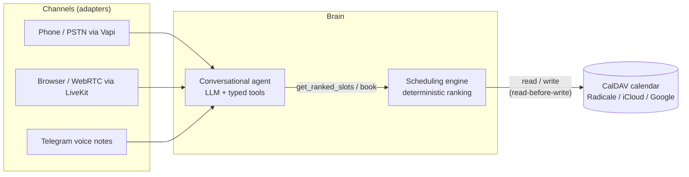

# Architecture

> Living document. Updated at the end of each phase; sections for
> components that are not built yet are marked as planned.

## Overview



The system is three layers with strict boundaries:

| Layer | Responsibility | Must never |
|---|---|---|
| Channels | Turn audio/text of a given transport into agent messages and back | Contain business logic |
| Agent | Understand the caller, collect qualification, call tools | Decide availability or invent slots |
| Engine + calendar | Decide which slots exist, in which order, and persist bookings | Talk to the user |

## Components

### Scheduling engine (`src/scheduling_engine/`) - built

A pure library, no I/O, no LLM dependency. Public API:

```python
rank_slots(day, busy_intervals, client_type, config) -> list[ScoredSlot]
```

Two stages:

1. **Hard constraints.** The day is gridded into fixed slots (default 15
   minutes) inside opening hours. A slot survives only if it is free, does
   not intersect a manual block, and fits a window allowed for the client
   type. All thresholds come from `PracticeConfig` (YAML).
2. **Compaction scoring.** Each surviving slot earns points per occupied
   neighbor (`adjacent_before`, default 10; `adjacent_after`, default 8).
   A slot filling a one-slot hole between two appointments earns both.
   Isolated slots score 0 and are offered last. Adjacency is evaluated
   inside a single opening window: a lunch break separates neighborhoods.

Every `ScoredSlot` carries a `score_breakdown` whose values sum to the
score, so any ranking decision can be traced and displayed.

Determinism is a contract, verified by tests: same inputs, same output,
ordering by score descending then start time ascending.

### Calendar adapter (`calendar_adapter/`) - planned, phase 1

Translates between the engine's `BusyInterval` view and a CalDAV server.
Key behaviors:

- **Read-before-write.** The slot is re-checked against the live calendar
  immediately before writing the booking. If it was taken meanwhile (the
  practitioner blocked it from their phone), the booking is refused and
  the agent re-ranks and re-offers.
- **Never overwrite.** The agent only creates new events on verified-free
  slots and only modifies events it created itself (tagged in the event).
- Radicale in development, any CalDAV endpoint in production. Timezone
  conversion happens here; the engine works in naive practice-local time.

### Conversational agent (`agent/`) - planned, phase 1

An LLM tool-calling loop. The tools are the only bridge to the engine:

| Tool | Contract |
|---|---|
| `qualify` | Enum-validated client type, visit type, service. Required before any availability question is answered. |
| `get_ranked_slots` | Returns ranked slots from the engine. The LLM never sees the raw calendar. |
| `book` | Requires a `slot_id` previously returned by `get_ranked_slots`, plus confirmed name and phone. |
| `reschedule` / `cancel` | Operate only on agent-created events. |

All tool schemas are strict (no additional properties, enums for closed
sets), so a malformed call fails validation instead of corrupting state.

Providers (LLM, STT, TTS) sit behind small interfaces in
`agent/providers/`; the default stack is OpenAI gpt-4o-mini, Deepgram
nova-3 and Cartesia Sonic, each swappable by environment variable.

### Language switching - planned, phase 2 (Telegram) and 3 (realtime)

STT tags each utterance with a detected language. The agent replies in
the language of the last user message; the orchestrator selects the TTS
voice accordingly. Adding a language is configuration plus one prompt
translation, not code.

### Channels (`channels/`) - planned, phases 2 to 4

- **Telegram** (phase 2): voice notes in, transcription, voice notes out.
  Turn-based, no latency constraint.
- **LiveKit / WebRTC** (phase 3): streaming pipeline with barge-in
  (interruption) support; the browser is the everyday test surface.
- **Vapi / PSTN** (phase 4): a free US number wired to the same brain;
  Vapi acts as telephony transport only.

### Evaluation harness (`evals/`) - planned, phase 5

LLM-simulated patient personas converse with the agent; a structured
judge inspects the transcript and the final calendar state (right slot
booked, identity confirmed, no rule violated, language followed).
Scenarios are YAML, replayed in CI, with per-language success rates
reported in the README.
