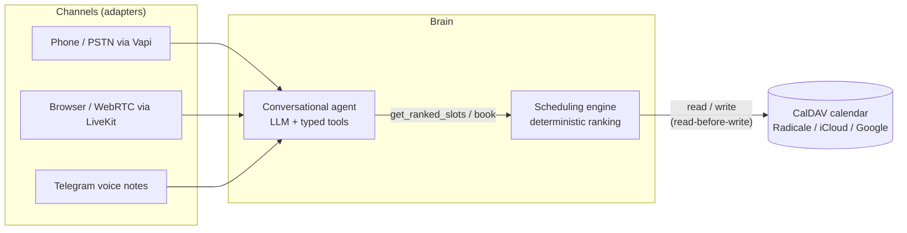

# Architecture

> Living document. Updated at the end of each phase; sections for
> components that are not built yet are marked as planned.

## Overview



The system is three layers with strict boundaries:

| Layer | Responsibility | Must never |
| --- | --- | --- |
| Channels | Turn audio/text of a given transport into agent messages and back | Contain business logic |
| Agent | Understand the caller, collect qualification, call tools | Decide availability or invent slots |
| Engine + calendar | Decide which slots exist, in which order, and persist bookings | Talk to the user |

## Components

### Scheduling engine (`src/scheduling_engine/`) - built

A pure library, no I/O, no LLM dependency. Public API:

```python
rank_slots(day, busy_intervals, client_type, config) -> list[ScoredSlot]
```

Two stages:

1. **Hard constraints.** The day is gridded into fixed slots (default 15
   minutes) inside opening hours. A slot survives only if it is free, does
   not intersect a manual block, and fits a window allowed for the client
   type. All thresholds come from `PracticeConfig` (YAML).
2. **Compaction scoring.** Each surviving slot earns points per occupied
   neighbor (`adjacent_before`, default 10; `adjacent_after`, default 8).
   A slot filling a one-slot hole between two appointments earns both.
   Isolated slots score 0 and are offered last. Adjacency is evaluated
   inside a single opening window: a lunch break separates neighborhoods.

Every `ScoredSlot` carries a `score_breakdown` whose values sum to the
score, so any ranking decision can be traced and displayed.

Determinism is a contract, verified by tests: same inputs, same output,
ordering by score descending then start time ascending.

### Calendar adapter (`src/calendar_adapter/`) - built

Translates between the engine's `BusyInterval` view and a CalDAV server.
Key behaviors, all covered by integration tests against a live Radicale
instance (the same in-process dev server the quickstart uses):

- **Read-before-write.** `book()` re-checks the span against the live
  calendar immediately before writing. If it was taken meanwhile (the
  practitioner blocked it from their phone), `SlotTakenError` is raised
  and the agent re-ranks and re-offers. CalDAV has no transactions; this
  shrinks the race window to milliseconds, which is acceptable for a
  single-practice calendar.
- **Never overwrite.** Every agent-created event carries the
  `POLYGLOT-AGENT` category; `cancel()` and `reschedule()` refuse
  anything else (`NotAgentEventError`). The practitioner's own events
  are read-only facts.
- **Manual blocks and vacations respected.** Events tagged `BLOCK`
  surface as `kind="block"`; all-day events block the whole day.
- Radicale in development, any CalDAV endpoint in production. Timezone
  conversion happens here; the engine works in naive practice-local time.

`calendar_adapter.devserver` serves Radicale in-process for development
and tests (it also works around a Radicale startup probe that crashes on
Windows without Developer Mode). `scripts/run_radicale.py` starts it;
`scripts/seed_calendar.py` fills a realistic demo week.

### Conversational agent (`src/agent/`) - built (text mode)

An LLM tool-calling loop. The tools are the only bridge to the engine:

| Tool | Contract |
| --- | --- |
| `qualify` | Enum-validated client type, visit type, service. Required before any availability question is answered. |
| `get_ranked_slots` | Returns ranked slots from the engine. The LLM never sees the raw calendar. |
| `book` | Requires a `slot_id` previously returned by `get_ranked_slots`, plus confirmed name and phone. |
| `reschedule` / `cancel` | Operate only on agent-created events. |

All tool schemas are strict (no additional properties, enums for closed
sets), so a malformed call fails validation instead of corrupting state.
Two invariants are enforced in code, not prompt: no availability
without qualification, and book/reschedule only accept a slot_id from
the latest ranked offer, so the model cannot book a time it invented.

LLM providers are stateless adapters behind one interface
(`agent/providers/`): OpenAI (gpt-4o-mini) and Gemini (2.5-flash) are
implemented and live-tested; the conversation history is kept in a
neutral format and translated per call, which is what makes providers
swappable mid-project. A scripted provider drives the test suite, so
the loop and toolbox are fully tested without any API key.

The loop is bounded (max tool rounds, fail-safe reply) and exposed
through an interactive CLI (`python -m agent.cli`) and a replayable
demo (`scripts/demo_conversation.py`).

### Language switching - built (text and Telegram voice)

The channel tags each utterance with its detected language (Deepgram
provides this per utterance in voice channels); the loop prepends an
authoritative `[lang=xx]` tag that the system prompt declares binding.
Deterministic tagging beats hoping the model notices: live tests showed
both providers ignoring a mid-call switch until the tag was added. The
orchestrator will select the TTS voice from the same tag. Adding a
language is configuration plus one prompt translation, not code.

### Channels

**Telegram (`src/channels/`) - built (phase 2).** Text and voice mix
freely in one conversation; modality is mirrored (text in, text out;
voice in, voice note out with the transcript as caption). One isolated
agent session per chat. The channel logic is SDK-free and fully tested
with fake speech providers; the python-telegram-bot glue adds chat
actions (typing / recording indicators), widened network timeouts for
slow uplinks, and an error handler that always tells the caller to
resend rather than failing silently.

The speech layer (`src/speech/`) was hardened by real phone sessions,
not just synthetic tests:

- Deepgram nova-3 in multilingual mode transcribes FR and EN well and
  tags each word's language; the utterance language is the dominant
  word language among the practice's declared languages.
- Two recovery layers catch recognition failures observed live: empty
  transcripts and hallucinated non-Latin scripts (a noisy French clip
  once came back in Mandarin) are retried with the fallback language
  forced.
- Persistent HTTP clients everywhere: TLS setup per clip cost seconds
  on a slow uplink (measured 3.0s down to 0.4s).

**Planned:**

- **LiveKit / WebRTC** (phase 3): streaming pipeline with barge-in
  (interruption) support; the browser is the everyday test surface.
- **Vapi / PSTN** (phase 4): a free US number wired to the same brain;
  Vapi acts as telephony transport only.

### Evaluation harness (`evals/`) - planned, phase 5

LLM-simulated patient personas converse with the agent; a structured
judge inspects the transcript and the final calendar state (right slot
booked, identity confirmed, no rule violated, language followed).
Scenarios are YAML, replayed in CI, with per-language success rates
reported in the README.
